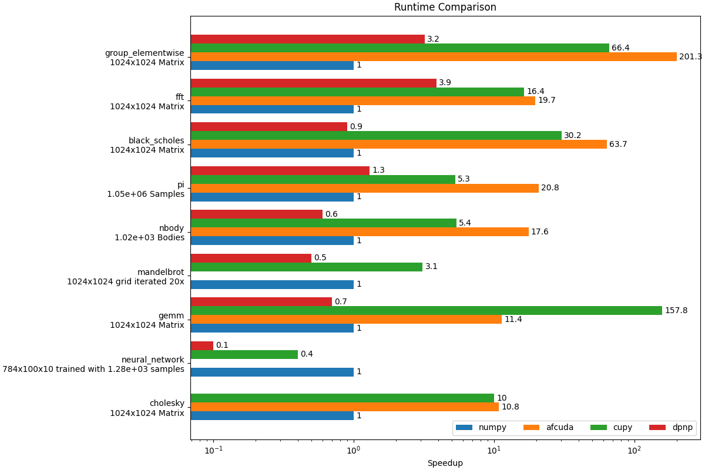

Benchmarks
===========

Set environment variable `DPNP_RAISE_EXCEPION_ON_NUMPY_FALLBACK` to 0.

## Setting up environment

```sh
    python -m pip install -r requirements.txt
```

## Running

You may run `run.sh` to setup the environment, run the benchmarks, and produce the graphs 

The steps in there are:

Run the benchmarks and store the results in `results.json`
```sh
    pytest .\pytest_benchmark --benchmark-json=results.json
```

To create graphs after creating the `results.json`, run:
```sh
    python graphs.py
```
To modify the tests being shown modify the `tests` list at the top of the `graphs.py` file.

Example:
</img>